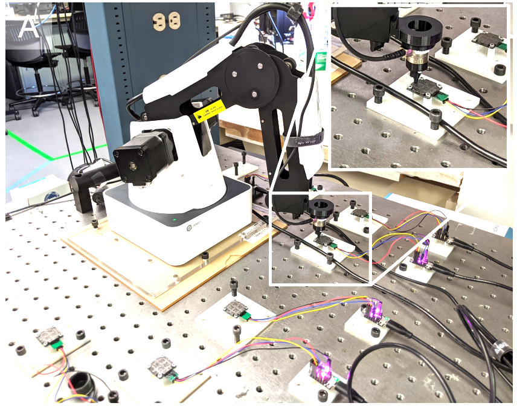

---
# try also 'default' to start simple
theme: seriph
# random image from a curated Unsplash collection by Anthony
# like them? see https://unsplash.com/collections/94734566/slidev
background: https://source.unsplash.com/collection/94734566/1920x1080
# apply any windi css classes to the current slide
class: 'text-center'
# https://sli.dev/custom/highlighters.html
highlighter: shiki
# show line numbers in code blocks
lineNumbers: false
# some information about the slides, markdown enabled
info: |
  ## Slidev Starter Template
  Presentation slides for developers.

  Learn more at [Sli.dev](https://sli.dev)
# persist drawings in exports and build
drawings:
  persist: false
# use UnoCSS
css: unocss
---

# ReSkin: versatile, replaceable, lasting tactile skins

Raunaq Bhirangi∗, Tess Hellebrekers∗, Carmel Majidi, Abhinav Gupta

CoRL '21

---

# Introduction

dexterous manipulation

We believe a significant bottleneck in dexterous manipulation is the lack of practical solutions to tactile sensing.

## Quality

* conformal contact
* accurate compression and shear force measurements
* high force (<0.1 N) and temporal resolution (>100 Hz)
* large surface area coverage (>4 cm2)

For practical reasons:
* compact and versatile
* inexpensive
* long-lasting

---

## Other Work

* CV
* Resistive/Capacitive
* Rigid

# Design and Fabrication

[fabrication video](https://www.youtube.com/watch?v=UBCOBzOkMS0)

---

# Experimental Setup

---

# Single Model

Goal:  magnetic flux B$\rightarrow$  $x,y,|F|$

Model:

$$B(15) \rightarrow MLP+ReLU(200) \rightarrow MLP(200) \rightarrow MLP(40)$$
$$\rightarrow MLP+ReLU(200) \rightarrow MLP+ReLU(200) \rightarrow xyF(3).$$

---

# Multi Sensor and Self-supervised Learning

* multiple sensors training
* triplet loss 

$$L_{triplet}=max(0,\Vert feat(B_a) - feat(B_p) \Vert^2 - \Vert feat(B_a)- feat(B_p)\Vert^2)$$

