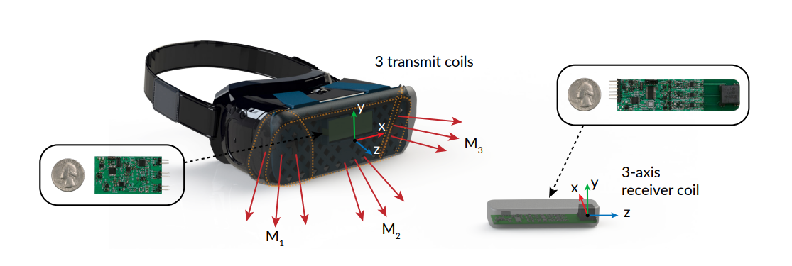
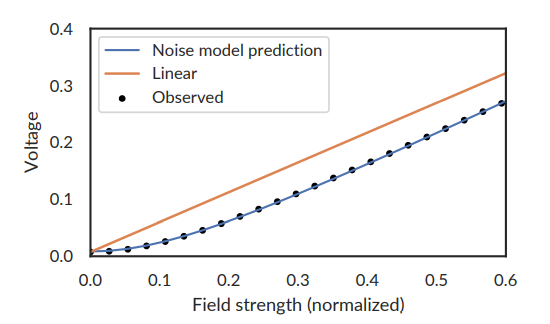
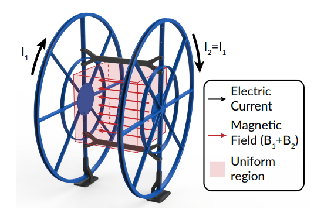

---
# try also 'default' to start simple
theme: seriph
# random image from a curated Unsplash collection by Anthony
# like them? see https://unsplash.com/collections/94734566/slidev
background: https://source.unsplash.com/collection/94734566/1920x1080
# apply any windi css classes to the current slide
class: 'text-center'
# https://sli.dev/custom/highlighters.html
highlighter: shiki
# show line numbers in code blocks
lineNumbers: false
# some information about the slides, markdown enabled
info: |
  ## Slidev Starter Template
  Presentation slides for developers.

  Learn more at [Sli.dev](https://sli.dev)
# persist drawings in exports and build
drawings:
  persist: false
# use UnoCSS
css: unocss
---

# Aura: Inside-out Electromagnetic Controller Tracking

Eric Whitmire, Shwetak Patel, Farshid Salemi Parizi

MobiSys'19

---

# Introduction
signifcant divide between handheld controllers for mobile VR/AR platforms and those for high-end desktop VR systems.

## Mobile Systems

Samsung Gear VR or Google Daydream

3-DoF small handheld controller 

## Desktop VR

Oculus Rift 

a larger controller with external light emitting diodes (LEDs)

6-DoF optical tracking

---

## Aura

* a inside-out 6-DoF novel low-power electromagnetic tracking technique 

* three coils embedded in a head-mounted display that each generate a unique magnetic feld oscillating at 100 kHz

* the signal in each receiver coil varies depending on
its position and orientation within the field

* no assumptions about the size, shape, or position of the transmit coils and no assumptions about nearby ferromagnetic material on the headset.

[Video](https://www.youtube.com/watch?v=P6TU2hA_R5w)

---

# System Implementation

## Transmitter

Each of the side generator coils consists of 30-40 turns of 22 AWG magnet wire wound around a 3D printed ABS frame.

magnetic field oscillating at 100 kHz

## Receiver

the controller uses an of-the shelf three-axis orthogonal receiver coil (Grupo Premo 3DCC08) to reconstruct the 3D magnetic field vector.

---

## Calibration

$r=g\sqrt{f^2+n^2}-b$

---

# Tracking

9 sensor values($r_{1x}...$) $\rightarrow$ 3 field vectors($f_1,f_2,f_3$)

## Position

$|f_i|,\forall i \in {1,2,3}$

$sin\theta$

## Orientation

