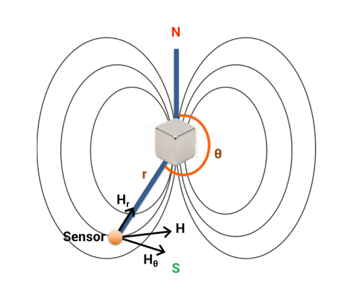
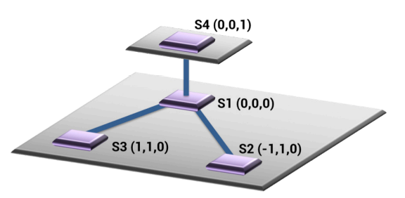

---
# try also 'default' to start simple
theme: seriph
# random image from a curated Unsplash collection by Anthony
# like them? see https://unsplash.com/collections/94734566/slidev
background: https://source.unsplash.com/collection/94734566/1920x1080
# apply any windi css classes to the current slide
class: 'text-center'
# https://sli.dev/custom/highlighters.html
highlighter: shiki
# show line numbers in code blocks
lineNumbers: false
# some information about the slides, markdown enabled
info: |
  ## Slidev Starter Template
  Presentation slides for developers.

  Learn more at [Sli.dev](https://sli.dev)
# persist drawings in exports and build
drawings:
  persist: false
# use UnoCSS
css: unocss
---

# Finexus: Tracking Precise Motions of Multiple Fingertips Using Magnetic Sensing
Ke-Yu Chen, Shwetak Patel, Sean Keller

ACM CHI 2016
---

# Introduction

Ideally, interaction with a virtual world should involve not discrete gestures but rather the natural, continuous movements of the user’s hands and fingers.

* CV based: occlusion issues(遮挡问题), limited to the view of the camera
* IMU: low-cost and occlusion-free; require frequent calibrations
* strain gauge(拉力计): strain gauge may shift

## Finexus

[视频演示](https://www.youtube.com/watch?v=fHhbM_2UMiI)

---

# Related Work

## CV-Based
* [IR camra](https://www.youtube.com/watch?v=9YsYo9_yq2A)

## On-Body Sensing

* EMG
* [bio-acoustic sounds](https://www.youtube.com/watch?v=g3XPUdW9Ryg)
* [electric field](https://www.youtube.com/watch?v=7lRnm2oFGdc)

A limitation of these approaches is that they allow only interaction based on discrete gestures. 

---

## Indirect Sensing
* [2.4 GHz signals](https://www.youtube.com/watch?v=VZ7Nz942yAY)
* [doppler-shifted signals](https://www.youtube.com/watch?v=fnFUv2v7Gbg)

require accurate sensor calibration 

rely on signal reflections from the human body and hence suffer from occlusion issues
## Magnetic Field Sensing

* [Razer Hydra](https://www.youtube.com/watch?v=SKLv8tyL2vU&t=708s)

---

# Finexus

GPS technique: trilateration

the strength of magnetic field H can be defined with two factors, r and θ.

$\Vert H_r \Vert = Mcos\theta / 2\pi r^3$

$\Vert H_\theta \Vert = Mcos\theta / 4\pi r^3$

M is the magnetic moment

---

## Resolving the Spatial Ambiguity

To apply trilateration, the first step is to calculate the distance r between the electromagnet and sensors.

$$
\begin{split}
\Vert H \Vert ^2 &= (H_r)^2+(H_\theta)^2 \\
&=K*r^{-6}*(3 cos^2\theta+1)
\end{split}
$$
To obtain instead an over-constrained system, we leverage multiple sensors in a fixed, known layout.

        

$$
\begin{split}
r_1=[x^2+y^2+z^2]^{1/2} &\quad r_2=[(x+1)^2+(y-1)^2+z^2]^{1/2}\\
cos\theta_1 = z/r_1 &\quad cos\theta_2=z/r_2
\end{split}
$$

---

# Tracking Multiple Points

AC-driven electromagnets operating at different 
frequencies: 70 Hz, 85 Hz, 100 Hz, 115 Hz, and 125 Hz

The bandpass filter is a 6th order finite impulse response (FIR) filter with the 3 dB cutoff at +2 and -2 Hz from the center frequency. 

	

Hilbert transform to extract the envelope of the sinusoid signal

---

### Process Pipeline

1. Read the magnetic vector H from magnetic sensors and keep it in a sliding window of size 160
2. * Bandpass filter
	* Hilbert transform
3. Calculate $\Vert H \Vert$
4. replace $r$ and $\theta$ with $x,y,z$
5. solve $x,y,z$

### Implementation 

The main process(Java):

1. data extraction from the PCB through the serial port
2. multithreading worker threads
3. rendering the tracking results. 

Each worker thread(Python):
* core signal processing for the individual 
electromagnets.

---

### PCB Design

 
The PCB has four magnetometers and three microcontrollers.

The custom electromagnet has a cutaway section area of 0.25 $cm^2$ with 300 turns of coil, ferrite as the core material.

media software MAX $\rightarrow$ external audio card(UltraLite mk3) $\rightarrow$ amplifier board(SURE TDA7498)