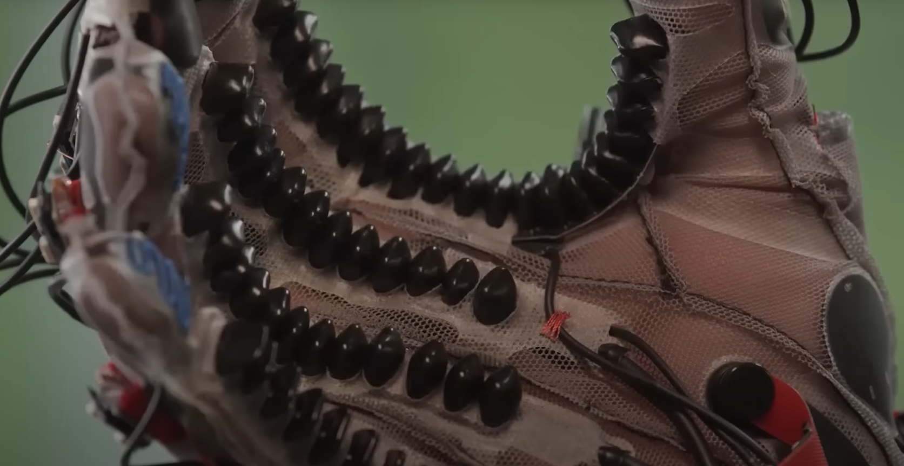
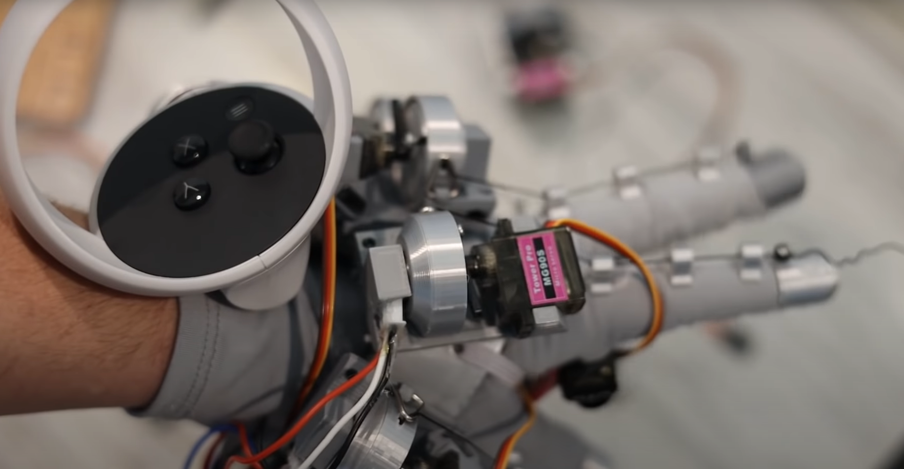
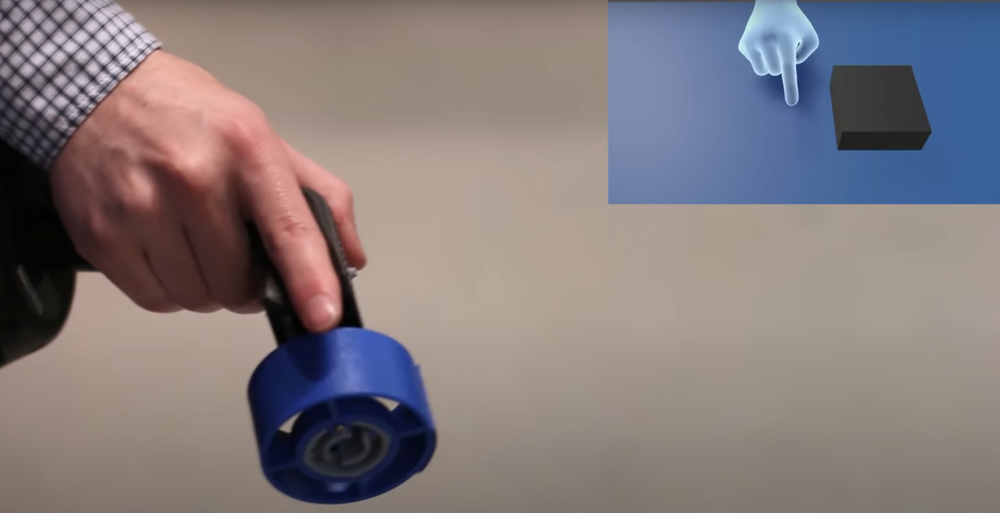
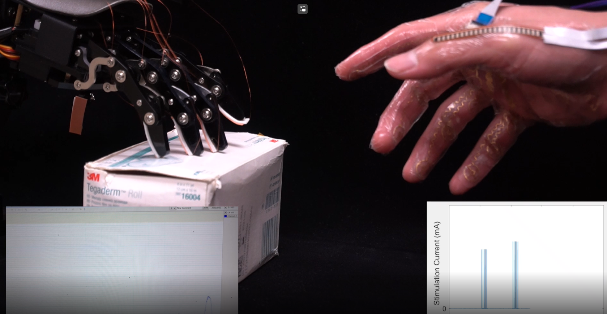
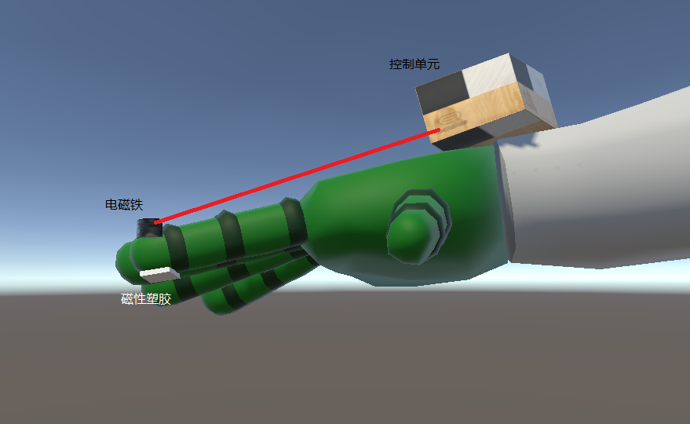
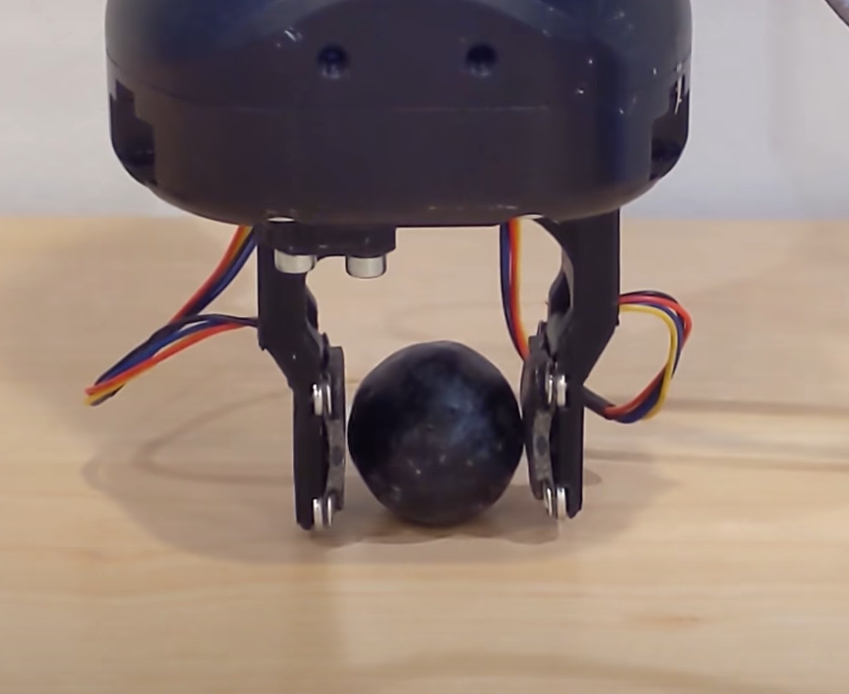
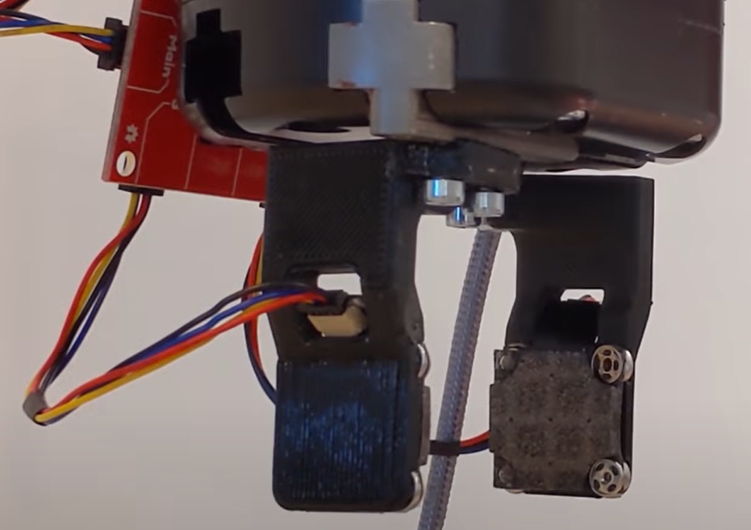

---
# try also 'default' to start simple
theme: seriph
# random image from a curated Unsplash collection by Anthony
# like them? see https://unsplash.com/collections/94734566/slidev
background: https://source.unsplash.com/collection/94734566/1920x1080
# apply any windi css classes to the current slide
class: 'text-center'
# https://sli.dev/custom/highlighters.html
highlighter: shiki
# show line numbers in code blocks
lineNumbers: false
# some information about the slides, markdown enabled
info: |
  ## Slidev Starter Template
  Presentation slides for developers.

  Learn more at [Sli.dev](https://sli.dev)
# persist drawings in exports and build
drawings:
  persist: false
# use UnoCSS
css: unocss

layout: cover
---

# 2023届毕设开题报告
# 基于可控磁场触控感知技术研究

#### 王思远

**指导老师**：陈东尧 张玥

---

# 目录

* 任务简述
* 研究前沿
* 方案草图
* 毕设进度
* 文献翻译

---
---

# 任务简述

## 触觉感知
一种执行设备，能够产生多种模式的触觉刺激
* 力
* 振动
* 热刺激
* 形状

> 这种类型的设备能够支持人的双手进行精细的操作，并同时刺激人的触觉通道的多个感受器（包括皮肤和动觉感受器）。为了确保真实的感觉，刺激不同感受器的触觉刺激应该以一致的空间和时间方式显示，也就是说，这些多维刺激之间的空间搭配误差和时间延迟需要小于人类的分辨阈值。通过多模态触觉设备，用户能够在虚拟现实应用中感知到虚拟物体的多种属性。[^1]

[^1]: [D. Wang, K. Ohnishi and W. Xu, "Multimodal Haptic Display for Virtual Reality: A Survey," in IEEE Transactions on Industrial Electronics, vol. 67, no. 1, pp. 610-623, Jan. 2020, doi: 10.1109/TIE.2019.2920602.](https://ieeexplore.ieee.org/document/8733996)

---
layout: two-cols
---

# 研究前沿

[^1]

[^1]: [haptic gloves by meta](https://uploadvr.com/meta-haptic-gloves-research)

::right::

# &nbsp;

[^2]

[^2]: [home-made vr gloves $60](https://www.youtube.com/watch?v=ZTzn37Usa-U)

---
layout: two-cols
---

# 研究前沿

[^1]

[^1]: [HapticRevolver](https://www.microsoft.com/en-us/research/publication/haptic-revolver-reconfigurable-virtual-reality-controller/)

::right::

# &nbsp;

[^2]

[^2]: [ElectroTactile](https://www.nature.com/articles/s42256-022-00543-y)
---
layout: two-cols
---

# 方案草图

## 毕设内容

一种可佩戴在手上的压力产生装置
* 使用弹性磁材料包裹皮肤
* 电磁铁驱动
* 通过调整不同电磁铁的电流控制压力和触点

::right::

# &nbsp;

---

# 毕设进度
| 时间  | 进度         | 备注                                   |
|-------|------------|----------------------------------------|
| 01-31 | 文献翻译     |                                        |
| 02-20 | 基本模型测试 | 测试电磁铁模型产生压力能否满足使用要求 |
| 03-20 | 文献调研     |                                        |
| 03-31 | 动态模型改进 | 测试通过控制电磁铁电流改变压力大小     |
| 04-15 | 数据收集     | 收集实验数据，评估模型表现              |
| 05-15 | 撰写报告     |                                        |

---

# 文献翻译

“ReSkin: versatile, replaceable, lasting tactile skins”
> 在这篇文章中，作者使用了磁塑胶材质制成的贴片进行压力检测。通过贴片外的磁力计记录磁场变化，使用机器学习方法训练模型计算触点位置和压力大小

